<p align="center">
  
</p>

<h1 align="center">
  <picture>
    <source media="(prefers-color-scheme: dark)" srcset="docs/marca/logotipo-oscuro.png">
    
  </picture>
</h1>

<p align="center"><b>Tu dinero, claro y en un solo lugar.</b></p>

Finanzas es una app web para llevar las cuentas de la casa: cuánto entra, cuánto sale, en qué se va y cuánto te queda para gastar este mes. Está pensada para Colombia (pesos colombianos y notificaciones de los bancos de aquí), la puedes instalar en tu propio servidor y la pueden usar varias personas, cada una con sus datos.

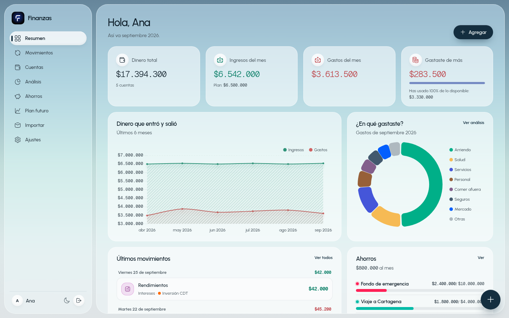

> Los pantallazos usan datos inventados.

## Entrar

Cada persona crea su cuenta con su correo y una clave, y solo ve sus propios datos. La pantalla de entrada se adapta al computador y al celular.

| En el computador | En el celular |
|:---:|:---:|
| 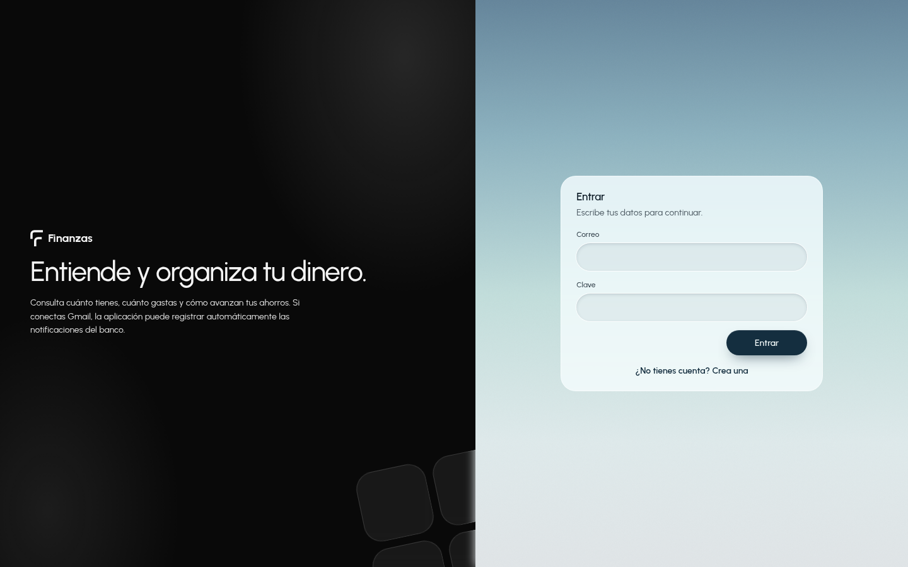 | 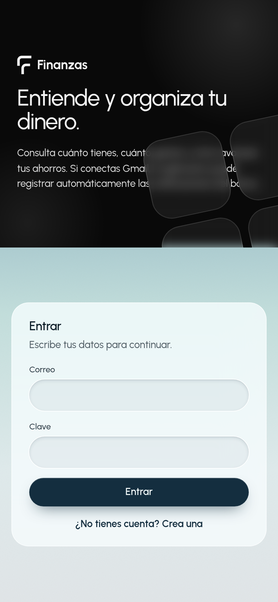 |

## ¿Qué puedes hacer?

### Ver cómo vas este mes
El **Resumen** te muestra de un vistazo cuánto dinero tienes en total, cuánto entró y salió este mes y, lo más importante, **cuánto te queda libre para gastar** (o cuánto te pasaste). También verás en qué se te fue la plata y cómo van tus ahorros.

### Anotar tus movimientos
Registra **ingresos, gastos y transferencias** entre cuentas. A cada movimiento le puedes poner categoría, notas, etiquetas y hasta **adjuntar la foto de la factura** o un PDF. Puedes buscar y filtrar por cuenta, categoría o tipo.

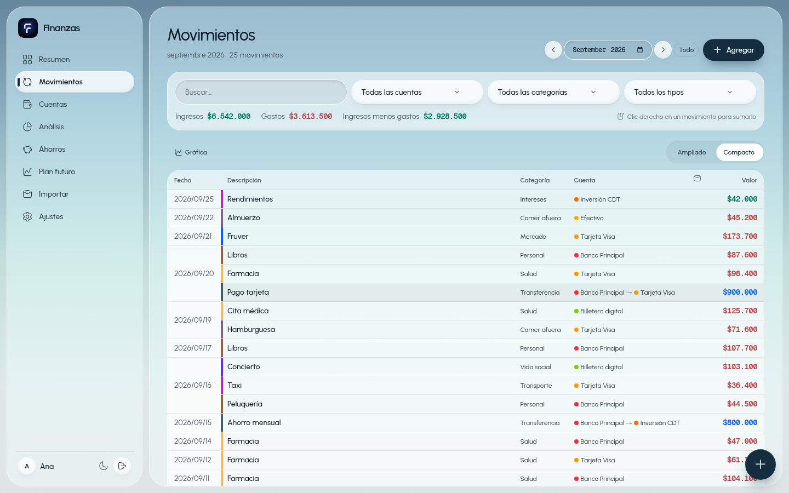

### Tener todas tus cuentas juntas
Banco, tarjeta de crédito, efectivo, billeteras digitales, inversiones… Cada cuenta muestra su saldo y su color. Ves cuánto tienes en total, cuánto está apartado para ahorros y cuánto debes.

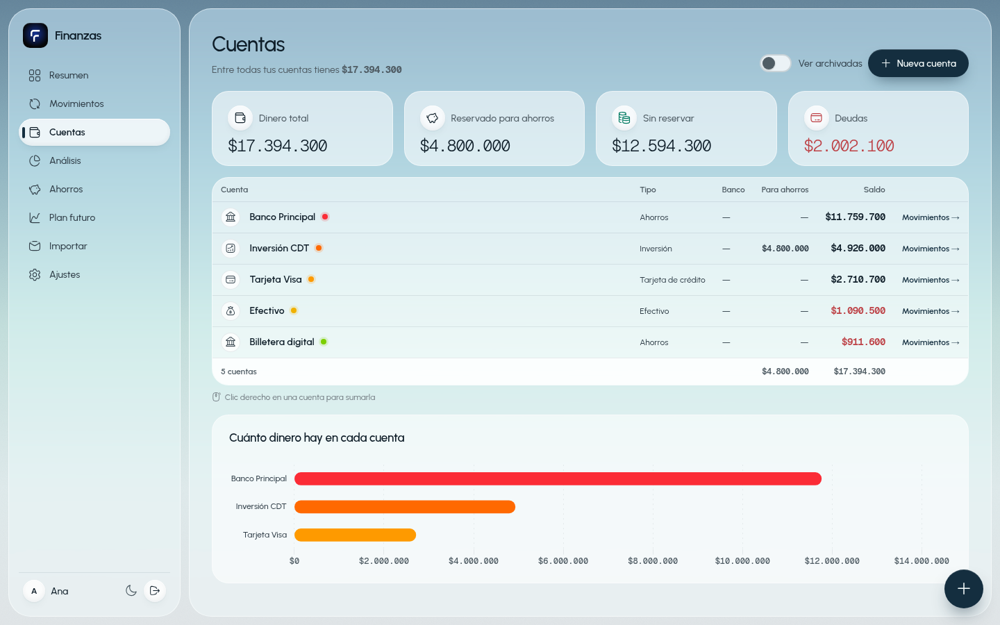

### Que los movimientos lleguen solos
No tienes que escribir cada compra:

- **Conecta tu Gmail** y la app lee cada 30 minutos las notificaciones de tu banco (Bancolombia, Nequi, Davivienda, BBVA, Nu, Bold y otros) y crea los movimientos **ya clasificados**.
- **Pega un SMS o un correo** del banco y la app lo convierte en movimientos (antes te muestra una vista previa).
- **Sube un CSV** exportado de otra app de gastos.

Nunca se duplica nada. Si anotaste un gasto a mano y luego llega el mismo desde el banco, la app te pregunta si es el mismo. Lo que no tenga claro queda marcado con `#revisar`.

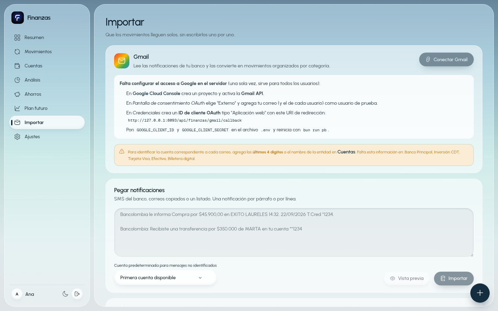

### Entender en qué se va tu plata
En **Análisis** comparas ingresos y gastos por semana, mes o año, y ves el reparto por categoría con un presupuesto para cada una.

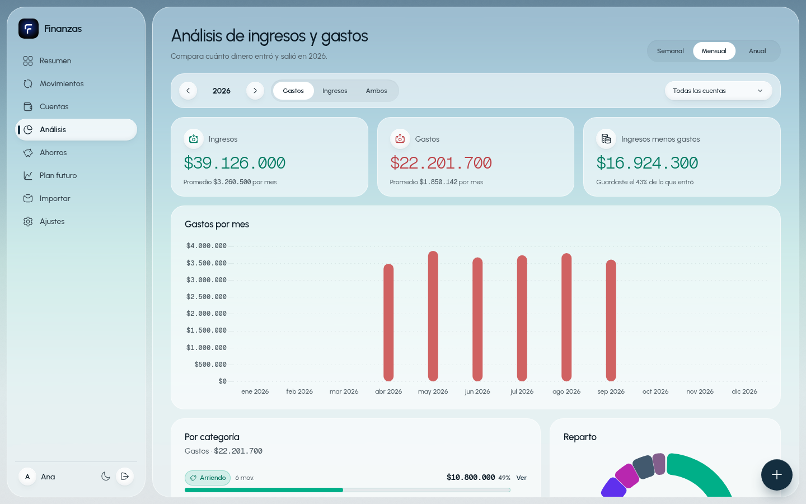

### Ahorrar con metas
Crea ahorros con **meta, aporte mensual y rentabilidad**. La app calcula para cuándo llegas a la meta. Un ahorro se puede repartir entre varias cuentas y **compartir con otra persona** (por ejemplo, un viaje en pareja). Los aportes pueden ser automáticos.

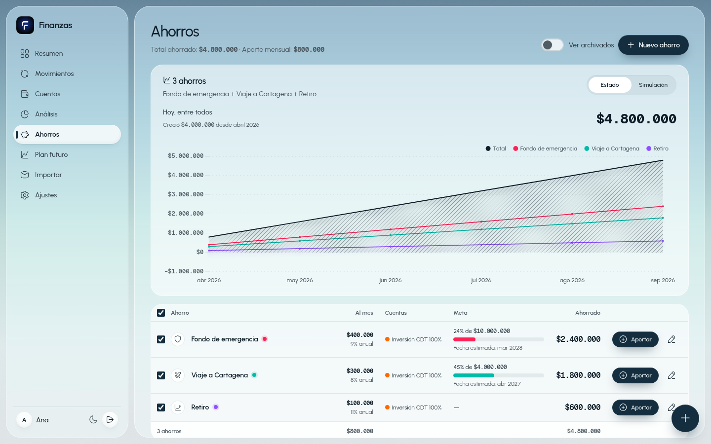

### Planear el futuro
En **Plan futuro** pones tus ingresos fijos (sueldo) y tus gastos fijos (arriendo, servicios, seguros), y la app hace la cuenta:

> **Ingresos − gastos fijos − ahorros = lo que puedes gastar**

Además proyecta los próximos 12 meses, tiene un **simulador** y responde preguntas como "¿para cuándo tendría $10.000.000?". Los fijos que marques se crean solos cada mes.

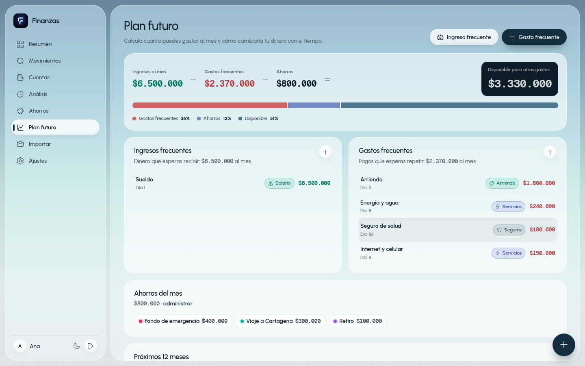

### En el celular
La app **se instala en el celular** como una aplicación más (desde el navegador: *Agregar a pantalla de inicio*) y tiene una versión hecha para el teléfono:

- **Diario**: tus movimientos día por día, con lo que entró y salió cada día.
- **Calendario**: el mes completo, con el gasto de cada día a la vista.
- **Mensual**: el año mes a mes y semana a semana.
- **Total**: cómo vas con tu presupuesto libre, tus gastos fijos y cada cuenta.
- **Estadísticas**: en qué se fue la plata, en porcentajes.
- **Cuentas**: lo que tienes, lo que debes y el balance.
- **Anotar en segundos**: toca el **+**, escribe el valor, elige categoría y cuenta, y listo.

Además **funciona sin internet**: lo que anotes sin señal se guarda en el teléfono y se envía solo cuando vuelve la conexión.

| Diario | Calendario | Mensual | Total |
|:---:|:---:|:---:|:---:|
| 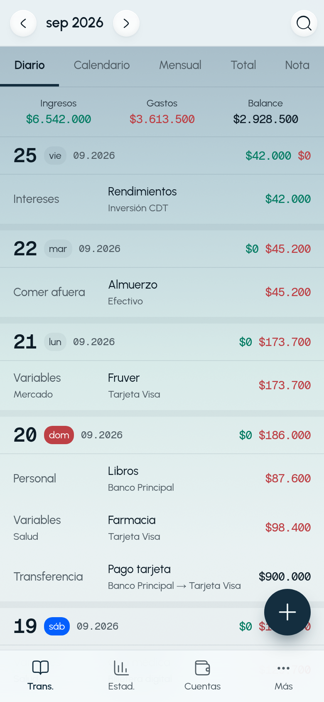 | 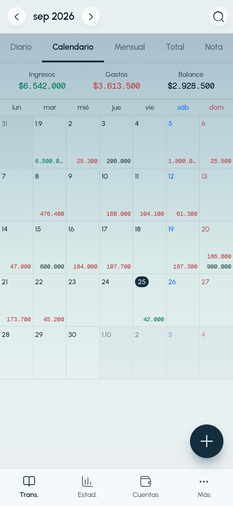 | 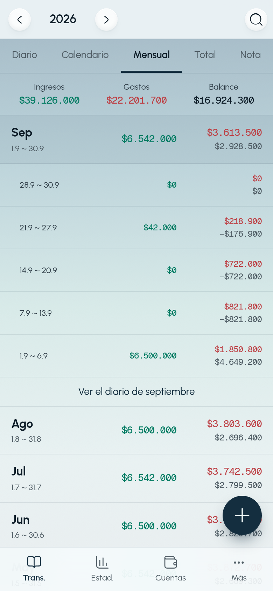 | 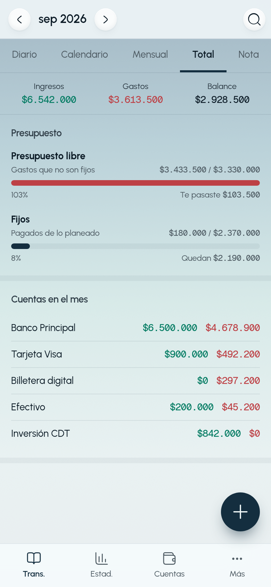 |
| **Estadísticas** | **Cuentas** | **Anotar un gasto** | **Modo oscuro** |
| 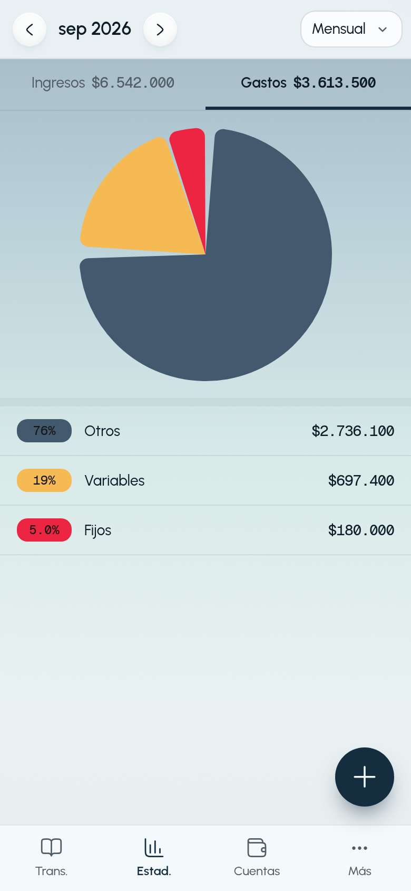 | 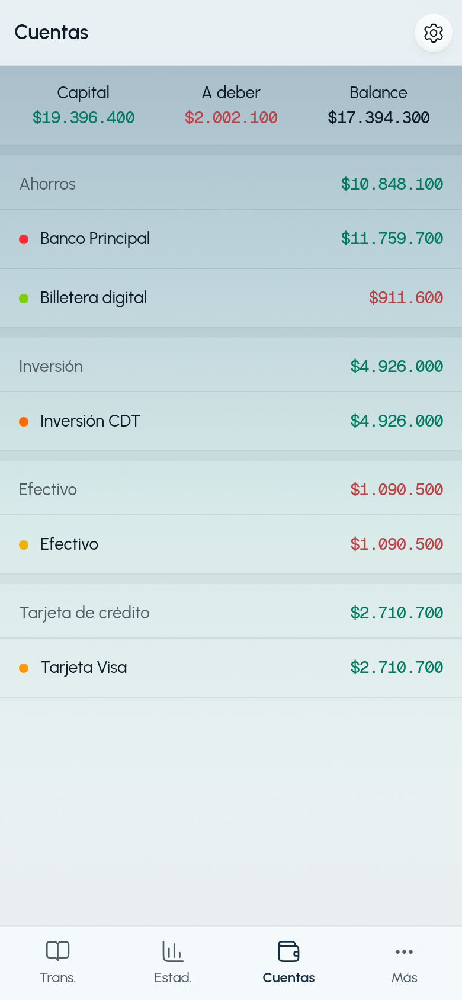 | 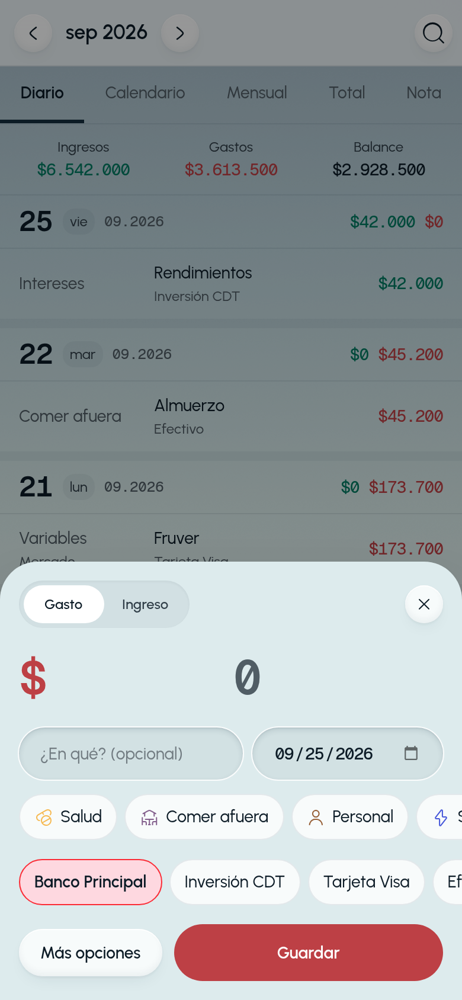 | 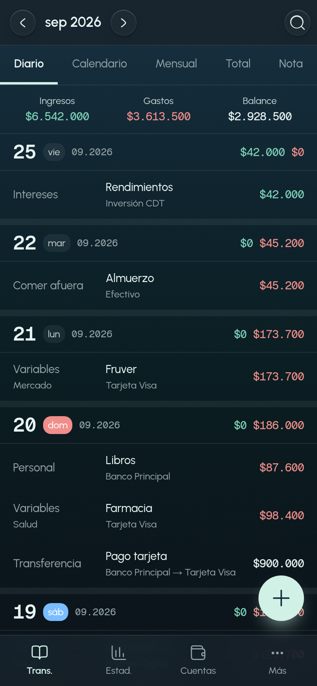 |

### Y además…
- **Reglas automáticas**: "si el movimiento dice *Netflix*, es Entretenimiento". Las categorías también aprenden con palabras clave (por ejemplo `exito, carulla, d1` → Mercado).
- **Modo claro y oscuro**.
- **Respaldo**: exporta todos tus datos a un archivo y vuelve a cargarlos cuando quieras, incluso en otro servidor.
- **Varios usuarios**: cada persona se registra con su correo y solo ve sus datos.

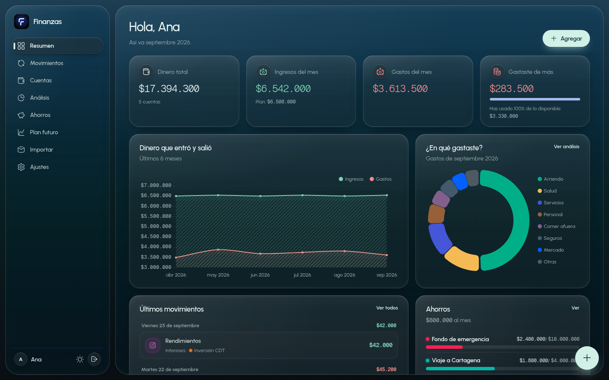

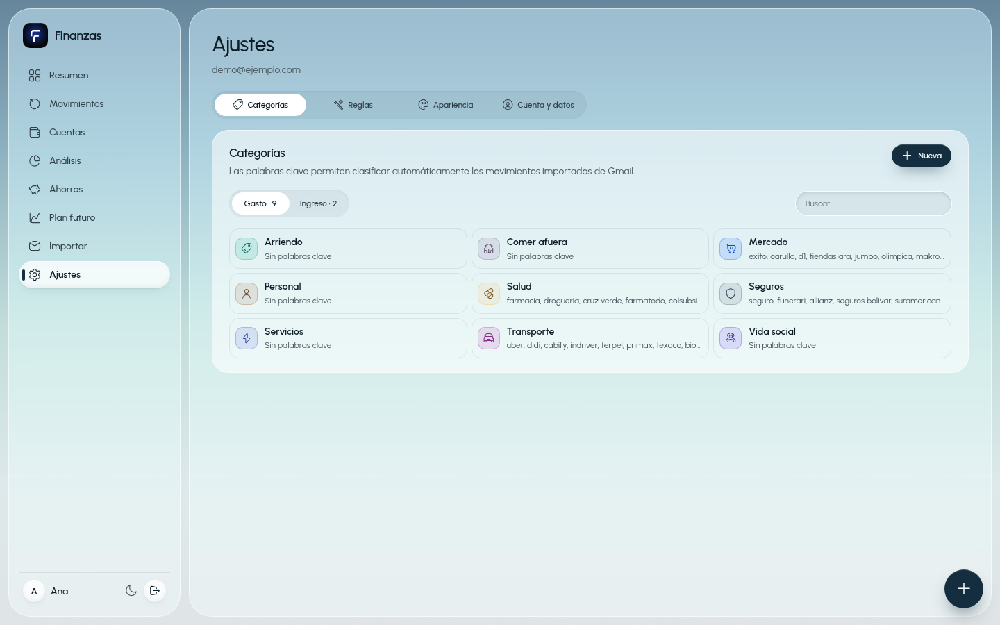

---

## Instalar en un servidor (con Docker)

Es la forma recomendada. Todo corre en **un solo contenedor**: la base de datos, la API y la página web.

### Qué necesitas

- Un servidor o computador con **Linux de 64 bits (x86_64/amd64)** y **Docker** con Docker Compose.
- Pocos recursos: es un solo programa liviano. El disco crece con tus movimientos y adjuntos.
- Opcional: un **dominio con HTTPS** (por ejemplo detrás de Nginx Proxy Manager, Caddy o Traefik). Es necesario para instalarla en el celular y para conectar Gmail desde fuera de tu red.
- Opcional: una **cuenta de Google Cloud** si quieres la lectura automática de Gmail (ver más abajo).

### Paso a paso

1. **Descarga el código y construye la imagen**

   ```bash
   git clone <url-de-este-repositorio> finanzas
   ```

   ```bash
   cd finanzas && docker build -t plane-finanzas:latest .
   ```

2. **Prepara una carpeta para la app** (ahí quedan tus datos)

   ```bash
   mkdir -p /opt/finanzas/pb_data && cp deploy/docker-compose.yml /opt/finanzas/
   ```

3. **Crea el archivo `/opt/finanzas/.env`** con la dirección donde vas a abrir la app:

   ```ini
   # La dirección pública de la app (la que escribes en el navegador)
   APP_URL=https://finanzas.midominio.com
   WEB_URL=https://finanzas.midominio.com

   # Solo si vas a conectar Gmail
   GOOGLE_CLIENT_ID=
   GOOGLE_CLIENT_SECRET=
   ```

   Si solo la vas a usar en tu red local, pon la IP y el puerto, por ejemplo `http://192.168.1.50:3434`.

4. **Arranca**

   ```bash
   cd /opt/finanzas && docker compose up -d
   ```

   La app queda en el puerto **3434**. Ábrela en el navegador, toca **Crear cuenta** y listo.

5. **(Opcional) Crea el administrador** del panel de la base de datos (`/_/`):

   ```bash
   docker exec plane-finanzas /pb/pocketbase superuser upsert admin@correo.com una-clave-larga --dir /pb/pb_data
   ```

### Actualizar

Descarga los cambios, vuelve a construir la imagen y reinicia. Tus datos (`pb_data`) y tu `.env` no se tocan.

```bash
git pull && docker build -t plane-finanzas:latest .
```

```bash
cd /opt/finanzas && docker compose up -d
```

> Si construyes en tu computador y el servidor es otro, puedes enviarle la imagen con
> `docker save plane-finanzas:latest | gzip | ssh usuario@servidor "gunzip | docker load"`.

### Copias de seguridad

Todo lo importante está en la carpeta `/opt/finanzas/pb_data`. Cópiala de vez en cuando. Cada usuario también puede exportar sus datos desde **Ajustes → Cuenta y datos → Exportar**.

---

## Conectar Gmail (opcional)

Se hace **una sola vez en el servidor** y sirve para todos los usuarios. Google solo le da permiso de **lectura** a la app.

1. Entra a [Google Cloud Console](https://console.cloud.google.com/), crea un proyecto y activa la **Gmail API**.
2. En **Pantalla de consentimiento OAuth** elige "Externo" y agrega como *usuarios de prueba* los correos que se van a conectar.
3. En **Credenciales** crea un **ID de cliente OAuth** de tipo *Aplicación web*, con este URI de redirección:
   `https://finanzas.midominio.com/api/finanzas/gmail/callback` (tu `APP_URL` + `/api/finanzas/gmail/callback`).
4. Copia el ID y el secreto en `GOOGLE_CLIENT_ID` y `GOOGLE_CLIENT_SECRET` del `.env` y reinicia (`docker compose up -d`).
5. En la app: **Importar → Conectar Gmail**.
6. En **Cuentas**, ponle a cada cuenta sus **pistas** (los últimos 4 dígitos o el nombre del banco) para que cada correo caiga en la cuenta correcta.

---

## Para desarrolladores

Hecha con **Svelte 5** + **PocketBase** (base de datos, usuarios y API en un solo binario) + **Chart.js**.

### Requisitos

- [Bun](https://bun.sh) 1.x
- Linux o macOS (el script descarga PocketBase para tu sistema)

### Arrancar en local

```bash
bun install
```

```bash
bun run dev
```

Eso levanta la API en `:8093` y la web en http://localhost:3434 (descarga PocketBase si falta). Para Gmail en local copia `.env.example` a `.env`.

Datos de ejemplo desde un CSV del registro contable (se puede correr varias veces sin duplicar):

```bash
bun run seed -- --email yo@correo.com --password "clave-larga" --name "Yo" --file mi-registro.csv
```

### Comandos

| Comando | Qué hace |
|---|---|
| `bun run dev` | PocketBase + Vite en una sola terminal |
| `bun run pb` / `bun run web` | Solo la API / solo la web |
| `bun run pb:admin correo clave` | Crea el administrador del panel `/_/` |
| `bun run test` | Tests del lector de notificaciones y de los cálculos |
| `bun run check` | Revisión de tipos (svelte-check) |
| `bun run build` | Compila la web a `pocketbase/pb_public` (PocketBase la sirve) |

### Estructura

```
pocketbase/
  pb_migrations/   esquema (colecciones + reglas por usuario)
  pb_hooks/        Gmail, importar texto, reglas, respaldo, tareas automáticas
    lib/parsers.js lector de notificaciones bancarias (probado en tests/)
src/
  routes/          Resumen, Movimientos, Cuentas, Análisis, Ahorros, Plan futuro, Importar, Ajustes, vista móvil
  components/app/  piezas de la app (formularios, tarjetas, listas)
  components/ui/   componentes base
  lib/finance.ts   cálculos: plan, ahorros, simulación, estados
  lib/outbox.ts    cola de cambios sin conexión
deploy/            docker-compose.yml de producción
docs/marca/        logo (SVG) y logotipo (claro y oscuro)
docs/capturas/     pantallazos del README
Dockerfile         imagen de producción (un solo proceso)
```

## Licencia

MIT. Ver [LICENSE](LICENSE).
